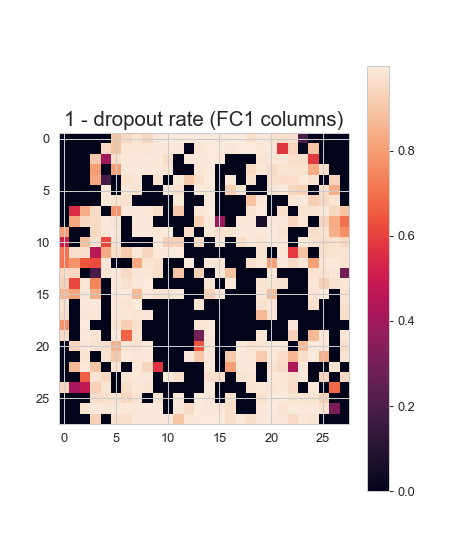

.pull-left[
NIPS paper [__Bayesian Compression for Deep Learning__](https://papers.nips.cc/paper/2017/file/69d1fc78dbda242c43ad6590368912d4-Paper.pdf)
+ __authors:__ Christos Louizos, Karen Ullrich, Max Welling, 

+ __main idea:__ _hierarchically_ apply a sparsity-inducing prior to weight parameters

+ __why:__
  - reduce model size for use on edge devices
  - latent variance parameters imply bit quantization
  - speed, energy savings
  
]


.pull-right[


FC1: $28^2 \times 300$; &nbsp; 
FC2: $300 \times 100$; &nbsp;
FC3: $100 \times 10$
]


--

.pull-left[
__my interest:__

+ interpretability......?

]

.pull-right[

]


---
## Prior: Scale mixture of Normals


Scale mixture of Normals prior placed on network weights:

$$z \sim p(z);  \quad w|z\sim N(0, z^2)$$

--

_e.g._ if $p(\cdot)$ is Bernoulli  $\rightarrow$  spike-and-slab prior

--

+ computationally expensive

--

+ $M \text{ weights} \rightarrow 2^M$ models to explore

--


###__2 priors used in paper:__

--

+ log-uniform (normal-Jeffrey's) prior: $p(z) \propto |z|^{-1}$  
  
  - improper, but nice marginal: $p(w) \propto \int \frac{1}{|z|} N(w|0, z^2) dz = \frac{1}{|w|}$ 
  
--

+ half-Cauchy $\rightarrow$ horseshoe prior

  - log-uniform prior is limiting case of the horseshoe (IG prior shape parameters $\rightarrow 0$)


---
## hierarchical-ality-ness


Share $\bf z$ across rows of the weight matrices $\bf W$<sup>[1]</sup>, i.e. corresponding to an input/feature<sup>[2]</sup>.


--


Joint prior (A = input dimension, B = output dimension): 

$$p({\bf W,z}) \propto 
               \prod_{i}^{A} \frac{1}{|z_i|}
               \prod_{ij}^{A,B} N(W_{ij}|0, z_i^2)$$


.footnote[
<font size = "3">
[1] moving to matrix notation

[2] weirdly, apparently in neural network weight matrices, inputs correspond to rows `r emo::ji("shrug")`
</font>
]


--

&nbsp;

###__why do we want to do this?__

--

+ _ordered sparsity_: can omit entire rows of weight matrix

--

+ AND if rows omitted in layer $l$, omit the columns in layer $l$-1!


---
class: center, bottom
## The secret sauce: variational Bayes

&nbsp;

--

In variational Bayes, we approximate the posterior distribution $p(\cdot)$ with some other distribution $q_\phi (\cdot)$

&nbsp;

--

(like, you know, a __Normal distribution__ 
`r emo::ji("heart")`
`r emo::ji("cake")`
`r emo::ji("dog")`
`r emo::ji("gymnastics")`)

&nbsp;

--

by tuning the variational parameters $\phi$ to minimize (usually) the KL divergence.

&nbsp;

&nbsp;

--

The KL divergence decomposes into two terms: 

&nbsp;

--

a constant with respect to $\phi$, and the Evidence Lower Bound (ELBO)

&nbsp;


---
## variational joint posterior

Thus we approximate the joint posterior $p({\bf W, z})$ with the variational distribution

$$q_\phi ({\bf W, z}) = \prod_i^A N(z_i|\mu_{z_i}, \mu_{z_i}^2 \alpha_i) \prod_{i,j}^{A,B} N(w_{ij} | z_i \mu_{ij}, z_i^2 \sigma_{ij}^2)$$

where $\alpha_i$ is the dropout rate.


--

+ via reparameterization ( $\sigma_{z_i}^2 \equiv \mu_{z_i}^2 \alpha_i$ ), obtain the ELBO $\mathcal{L}(\phi)$

  - $\mathcal{L}(\phi) =$
--
$\text{ ... math math mcmathy mathy math}$


--

+ the upshot is that we can avoid MCMC and instead do gradient descent (ascent?) on the ELBO, optimizing w.r.t. $\sigma^2_{z_i}$

  - (maximizing the ELBO is equivalent to minimizing $KL(q_\phi ({\bf W, z}) || p({\bf W, z})$)


---
## pruning via thresholding


The negative KL divergence for the variance parameter $z_i$ turns out to have a relatively simple form:

$$-KL(q_\phi(z)||p(z)) = \sum_i^A(k_1 \sigma(k_2 + k_3 \log \alpha_i)) - 0.5 m(-\log(\alpha_i) - k_1)$$

where $\sigma(\cdot), m(\cdot)$ are the sigmoid and softplus functions, and $k1, k_2, k_3$ are constants.

&nbsp;

--

**Note**: it only depends on $\alpha_i$!

Thus entire groups of parameters $w$ can be pruned simply by thresholding $\alpha_i = \sigma^2_{z_i} / \mu^2_{z_i}$


--

+ Recall: 

$$q_\phi ({\bf W, z}) = \prod_i^A N(z_i|\mu_{z_i}, \mu_{z_i}^2 \alpha_i) \prod_{i,j}^{A,B} N(w_{ij} | z_i \mu_{ij}, z_i^2 \sigma_{ij}^2)$$


---
## quantization


Does every weight parameter need to be stored as a 32-bit float?

--

What if the variance of the weight is large?

--

&nbsp;

Essentially, if the variance is large relative to the round-off error from storing a float using a reduced number of bits ....
--
well, that's __ok__!

&nbsp;

--

So the variational posterior's marginal variances 

$$V(w_{ij}) = \sigma^2_{z_i} (\sigma^2_{ij} + \mu^2_{ij}) + \sigma^2_{ij} \mu^2_{ij}$$

can be used to assess the bit precision necessary to represent the weights!


---
## interpretability

.pull-left[
+ idea: dropout in the input layer implies that a feature is unimportant

+ so not so much interpretability as feature selection

+ other work along these lines include [LassoNet](https://arxiv.org/abs/1907.12207)
]

.pull-right[

]


--


---
## implementation

+ pytorch-based implementation at [Karen Ullrich's github](https://github.com/KarenUllrich/Tutorial_BayesianCompressionForDL)


&nbsp;

--

&nbsp;

__experimentation thus far__

+ [MNIST and Fashion MNIST](https://akseong.github.io/Stat295_ML-DS/Final_Project/Bayesian_Compression.html)


```
## input (FC) layer compression: (300, 784) --> (113, 382)
## 2nd FC layer compression: (200, 300) --> (14, 113)
## output (FC) layer compression: (10, 200) --> (10, 14)

## Compressing the architecture will decrease the model by a factor of 6.6.
## Making use of weight uncertainty can reduce the model by a factor of 23.6.
```


