```{r setup, include=FALSE}
library(here)
library(ggplot2)
library(dplyr)
library(tidyr)
library(xaringanthemer)
library(gridExtra)
library(kableExtra)

knitr::opts_chunk$set(echo=TRUE)
knitr::opts_chunk$set(fig.height=6, out.width="100%")
library(ggplot2)
# reveal lines up to `upto` and highlight lines `highlight`
reveal <- function(name, upto, highlight) {
  content <- knitr:::knit_code$get(name)
  content[upto] <- gsub("+", "", content[upto], fixed=T)
  content[highlight] <- paste(content[highlight], "#<<")
  content[1:upto]
} 

if (!file.exists(here::here("drafts", "presentation", "libs", "remark-latest.min.js"))){
  xaringan::summon_remark()
}

xaringanExtra::use_xaringan_extra(
  c("tile_view", 
    "animate_css", 
    "panelset", 
    "scribble", 
    "freezeframe", 
    "tachyons"
  )
)
# xaringanExtra::use_progress_bar(color = "#0051BA", location = "top")
xaringanExtra::use_animate_all("fade")
xaringanExtra::use_extra_styles( # 
  hover_code_line = TRUE,
  mute_unhighlighted_code = TRUE
)


style_duo_accent(
  primary_color = "#009dd1",
  secondary_color = "#07628f",
  text_bold_color = "#07628f",
  title_slide_text_color = "#b1ebfc",
  title_slide_background_image = here::here("drafts", "presentation", "figs", "pink_mountains.jpg"),
  colors = c(
    pink = "#e63c80",
    darkpink = "#c22975", 
    red = "#e32929",
    purple = "#8800d1",
    blue = "#009dd1",
    darkblue = "#2a4191",
    teal = "#07628f",
    orange = "#ff8811",
    green = "#136f63",
    white = "#FFFFFF"
  )
)

# mykable function
mykable <- function(tab, cap = NULL,
                    latex_options=c("hold_position", "scale_down", "striped"), 
                    bootstrap_options=c("striped", "hover", "condensed"), 
                    full_width=F, position="center", ...){
  # kable formatting conditional on latex or html output
  # common additional unspecified args (...):
  #     digits = 2
  #     format.args = (list(big.mark = ","))
  require(kableExtra)
  if (is.null(getOption("knitr.in.progress"))){
    print(tab)
  } else if (knitr::is_latex_output()){
    kable(x=tab, caption=cap, ...) %>%
      kableExtra::kable_styling(latex_options = latex_options)
  } else if (knitr::is_html_output()){
    kable(x=tab, caption=cap, ...) %>%
      kableExtra::kable_styling(bootstrap_options = bootstrap_options, full_width=full_width, position=position)
  }
}
```

class: inverse, left

<style type="text/css">
  blockquote{
    background-color: #d5f2f5;
    font-size: x-large;
  }
  
  .attrib{
    font-size: x-large;
    width: 30%;
    position: relative;
    float: right;
    padding-right: 5%;
  }
  
  h1, h2, h3, h4, h5, h6{
    margin-bottom: 0px;
  }
  
  .lcode {
    color: #777;
    width: 38%;
    height: 92%;
    float: left;
  }
  .rplot {
    width: 60%;
    float: right;
    padding-left: 1%;
  }
  
  .lnarrow {
    color: #777;
    width: 23%;
    height: 92%;
    float: left;
  }
  .rwide {
    width: 75%;
    float: right;
    padding-left: 1%;
  }
  
  
  
  
  
  
  
  
  .middle2 {
    margin: 0;
    position: absolute;
    top: 50%;
  }
  
  .defn {
  font-weight: bold;
  font-style: strong;
  font-size: xx-large;
  color: #009dd1;
  }
  
  .bpink { 
  font-weight: bold;
  color: var(--color-pink); 
  }
  
  .remark-slide-content {
    font-size: 25px;
    padding: 1em 4em 1em 4em;
  }

  .content-box { 
      box-sizing: border-box;
      background-color: #e2e2e2;
  }
  .content-box-blue,
  .content-box-gray,
  .content-box-grey,
  .content-box-army,
  .content-box-green,
  .content-box-purple,
  .content-box-red,
  .content-box-yellow {
    box-sizing: border-box;
    border-radius: 15px;
    margin: 0 0 15px;
    overflow: hidden;
    padding: 0px 20px 0px 20px;
    width: 100%;
  }
  .content-box-blue { background-color: #F0F8FF; }
  .content-box-gray { background-color: #e2e2e2; }
  .content-box-grey {	background-color: #F5F5F5; }
  .content-box-army {	background-color: #737a36; }
  .content-box-green { background-color: #d9edc2; }
  .content-box-purple { background-color: #e2e2f9; }
  .content-box-red { background-color: #ffcccc; }
  .content-box-yellow { background-color: #fef5c4; }
  .content-box-blue .remark-inline-code,
  .content-box-blue .remark-inline-code,
  .content-box-gray .remark-inline-code,
  .content-box-grey .remark-inline-code,
  .content-box-army .remark-inline-code,
  .content-box-green .remark-inline-code,
  .content-box-purple .remark-inline-code,
  .content-box-red .remark-inline-code,
  .content-box-yellow .remark-inline-code { 
    background: none;
  }
</style>


# Contents

1. Bayesian Local Null Testing

  - misspecification & the cut orthogonal basis

  - Bayesian model selection

1. BVS in Deep Neural Networks

  - architecture compression to variable selection

  - restoring inferential parameters

1. Future Work

1. Appendices

???
- overall research theme
  - Bayesian Variable Selection in semi-parametric models
    - developing flexible methods that apply to a variety of settings - that's the semi-parametric part
    - and applying BVS to enhance the interpretability of these expressive models.

Another contribution I want to discuss today is not directly about BVS, but about delineating a common type of misspecification in local null testing
  - not discussed before


---

class: inverse, left, middle

# Bayesian Local Null testing

???
- Michele Guindani (now at UCLA)
- David Rossell (Universitat Pompeu Fabra in Barcelona)
- inspired by data from Ignacio Saez (then a neuroscientist at UC Davis, now at Mt Sinai)

- First exposure to additive models, BVS/BMS,
  - learned lessons about
    - simulating data NOT according to model


---
## Motivation: ECoG

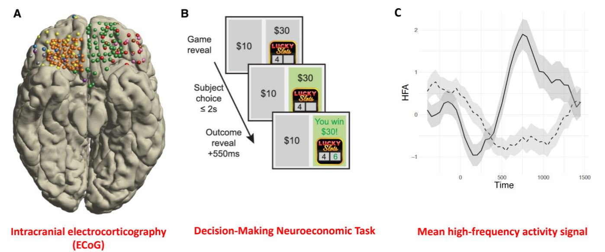

__Question of interest:__ Are game-level covariates associated with brain region activation (HF band) and, if so, _at what times_.

???
- gambling behaviors represented in brain, create a kind of neural profile

- 11 epileptic patients undergoing surgery;

+ high temporal and spatial resolution

+ quick (3 seconds) gambling game, ~ 200 rounds

+ interested in whether high-frequency activity (power) is correlated with task requirements/outcomes (e.g. risk/reward calculation, win/loss)

+ windowed measurements (200ms windows, 50ms increments)

+ from Ignacio Saez, then neuroscience prof at UC Davis, now at Mount Sinai


---
## Motivation: Salary

- 2019 Current Population Survey (Flood et al, 2020)

- n = 36,308 single-race individuals, ages 18-65, employed full-time, non-military

- response variable is log-10 annual work income

- Covariates: race, gender, possession of university degree, government-employed, self-employed.

- Question: are disparities in salary associated with covariates such as race and gender at different times in people's careers


???
simpler data (cross-sectional), independent obs

---
## Goal: not just if, but when or where

We want to be able to test whether $x_i \in \mathbb{R}^p$ is associated with outcome $y_i$ at coordinate $z_i \in \mathcal{R}^d$.

___

- **Electrocorticography (ECoG) data**
  - brain region activity ($y$) vs. covariates ($x$) at given time ($z$)
    - win/loss, risk, remorse, expected earning
  - multiple time points recorded for each subject-electrode-trial combination: non-linear, correlated data

- **Salary data**
  - Question: are disparities in salary associated with covariates such as race and gender ($x$) at different times ($z$) in people's careers
  - cross-sectional data: simpler, independent observations


???
- extendable to multi-dim z

- knowing IF is good, but even more useful would be knowing WHEN / WHERE
  - does the salary gap always exist?  does it start after a certain time, or end at a certain time?
  - more targeted interventions, e.g.
     - early- or mid-career equity initiatives
     - **WHICH interventions are effective WHEN**
  - which regions of the brain are correlated with different stimuli, how long is effect felt for
    - e.g. before time 0 would be risk / anticipation; after time 0 might be reward / regret

  - measuring how long it takes for the effect of a pharmaceutical to be felt; how long it takes to diminish.


---

## Goal: not just if, but when or where

We want to be able to test whether $x_i \in \mathbb{R}^p$ is associated with outcome $y_i$ at coordinate $z_i \in \mathcal{R}^d$.

___

### Challenges:
- Outcome $y_i$ at baseline is some unknown function of $z_i$.  We want to be able to model this flexibly.
- many $x_i$'s, including covariates not undergoing selection

**Semi-parametric models**, additive models in particular, are a natural fit:
- flexible, ease of interpretation & computation


???
- Our method needs to handle non-linearity.
- conceptually, the very enterprise / goal ---- to detect local regions of no effect --- requires this

---
## Setup

__Notation:__
- $F$ the true, unknown data-generating density.
- $x_{i1} \in \{1, ..., K \}$ a single covariate defining K distinct groups.

--

$$E_F[y_i] = \underset{\text{baseline}}{\underbrace{f_0(z_i)}} + \underset{\text{deviation}}{\underbrace{f_1(x_{i1}, z_i)}}$$
- sum-to-zero identifiability condition on $f_1$, i.e. $\sum_{k=1}^K f_1(k, z) = 0$, i.e. $f_1$ describes the deviation from baseline

--

The objective of local variable selection is to assess the local null hypothesis:

$$f_1(1, z) = f_1(2, z) = ... = f_1(K, z) = 0$$

for specific values of $z$


???
for now, assume independent obs and no other covariates


---
## Model

A typical way to estimate $f_0$ and $f_1$ is via the __Varying Coefficient model__ (Hastie & Tibshirani 1993)

$$E_\eta \left( y_i | z_i, x_{i1} = k  \right)    = \beta_0 (z_i) + \beta_{1k} (z_i) = w_{i0}^T \eta_0 + w_{ik}^T \eta_{1k}$$
--

- the coefficients $\beta_0 (z_i) + \beta_{1k} (z_i)$ are functions of $z$
- the coefficients are approximated via basis functions $w_{i0} = w_{i0}(z_i) \in \mathbb{R}^{l_0}$ and $w_{ik} = w_{ik}(z_i) \in \mathbb{R}^{l_1}$, e.g. cubic splines, and coefficients $(\eta_0, \eta_{1k})$
- projecting coordinates onto a basis lets us linearize the VC model


--
___

Assuming Gaussian errors, we can write this as:
$$y | Z, X \sim N(W_0\eta_0 + W_1 \eta_1, \Sigma)$$
- $W_0$ is a $n \times l_0$ matrix ($i^{\text{th}}$ row given by $w_{i0}$)
- $W_1$ is a $n \times l_1K$ matrix ($i^{\text{th}}$ row given by $(w_{i1}, ..., w_{iK})$)


---
## Model-based testing

__Local Null Hypothesis__ testing if group membership $k$ has an effect at $z$:

$$f_{11}(z) = f_{12}(z) = ... = f_{1K}(z) = 0$$
--

__Model-based local null test__:


$$E_\eta \left( y_i | z_i, x_{i1} = k  \right)    = \beta_0 (z_i) + \beta_{1k} (z_i) = w_{i0}^T \eta_0 + w_{ik}^T \eta_{1k}$$


- if $w_{ik}^T (z_i)\eta_{1k} = 0$, then $\beta_{1k}(z_i) = 0$, i.e. no effect of $x_{i1k}$ on $y_i$ at $z_i$

- So:
$$\eta_{11z} = \eta_{12z} = ... = \eta_{1Kz} = 0$$
(abusing notation to let subscript $z$ indicate the portion of the $l_1$-length vector $\eta_{1k}$ corresponding to bases covering a specific $z$)


???
are the coefficients associated with this basis all 0 or not?


---
## Misspecification
.pull-left[
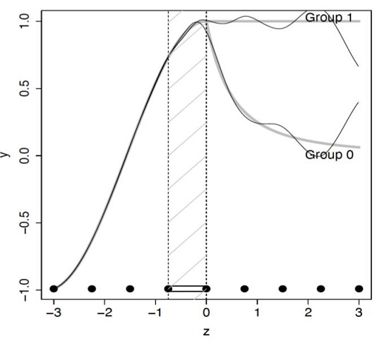
]

.pull-right[

- $x_{i1}$ is a binary covariate defining two groups

- group means are equal for $z \leq 0$, different for $z > 0$

- solid black lines are the projection of the true group means onto a cubic B-spline basis, .bpink[i.e. the best approximation possible] as $n \rightarrow \infty$

]


???

- just kept getting weird results.
- Performed nominally well at low n, but poorly at very high n, or when taking error terms out of simulated data.


---
## Misspecification
.pull-left[

]

.pull-right[


- problem arises from __overlap__ of bases / __sharing__ information.

- each interval between consecutive knots in a $l$-degree B-spline is represented by $l+1$ coefficients.

- this also means that each $l$-degree B-spline covers $l+1$ regions

- i.e. estimation of the mean function in one region uses information from other regions

- not only other regions, but the baseline function as well!

]


???
- If the baseline mean function can only be _approximated_ by the chosen basis, the other group's mean function approximation will try to improve on it.

- we like to be able to SHARE information across observations.  BUT sharing information in this context is problematic.  Instead of "SHARING", estimation of an effect at active coordinates CONTAMINATES estimation of effect at null coordinates.
  - true for any basis that overlaps / shares information across coordinates, e.g. Gaussian processes, etc.


__SIDENOTE__ this also highlights the importance of NOT SIMULATING DATA ACCORDING TO YOUR MODEL.

---

## Model Misspecification and testing

<!-- - Under mild conditions, most estimators $\hat\eta = (\hat \eta_0, \eta_1)$ converge to the values minimizing the Kullback-Leibler divergence. -->

- In the independent error case, the optimal value $\eta^\star$ minimizing mean-squared prediction error under $F$ is:

$$\begin{align}
\eta^\star
&=
\underset{\eta}{\arg \min}~ E_F \left[  (y - W\eta)^T(y-W\eta) |Z, X   \right] \\
&=\left( W^T W \right)^{-1} W^T E_F (y | Z, X)
\end{align}$$

--

- if $\left( W^T W \right)^{-1} W^T$ is not sparse, it is likely that the optimal coefficient values in $\eta_{1k}^\star$ associated with a specific region will be non-zero even when the group means are equal in that region.

--

- in the case above with cubic splines, $\Pr(\text{T1 error}) \rightarrow 1$ as $n \rightarrow \infty$


---
## Alternatives

- add more knots
  - problem of inconsistency persists
  - lower power
  - number of models grows exponentially with knots


- Gaussian processes, other bases
  - problem of inconsistency persists


- tree-based methods
 - e.g. VC-BART (Deshpande et al, 2020)
 - good at estimation and prediction
 - controlling type I error is not straightforward

--

___

- Model-based tests can lead to incorrect conclusions when the mean
model is misspecified, i.e. the approximation does not perfectly capture the true mean

- not a Bayesian or Frequentist issue


???

asymptotic consistency  ---- get the right answer when $n \rightarrow \infty$ seems like a basic requirement for a stat method.

Gaussian processes --- Kernel function is going to share info across regions
IWT of Pini & Vantini 2017 --- distribution on area between curves.  Still runs into problem of asymptotic inconsistency.


---

## Our proposal: Orthogonal Cut Basis


.content-box-blue[

__Def'n:__

An __Orthogonal Cut Basis__ is  a basis for $\beta_{1k}(z)$ that

1. has support only in a single region $R_b$ (hence a _cut_ basis)
1. is __orthogonal__ to bases outside that region.

]


- note that it is not required for $\beta_0(z)$

- balances sharing and localizing information.
  - for any choice of knots, prevents false positives
  - can handle independent as well as correlated data
  - can be extended to multivariate $z_i$
  - orthogonal cut basis is a specific projection of the design matrix.  Standard computational and inferential machinery is still available / applicable.

---
## Procedure:

- Partition $z$ into a set of regions $\mathcal{R} = \{R_1, R_2, ..., R_{|\mathcal{R}|} \}$  regions (for now, assume given)


- create a basis $W = (W_0, W_1)$, where rows $(y_b, W_{0b}, W_{1b})$ in $(y, W_0, W_1)$ represent observations in $R_b$, using a __cut__ basis $W_1$ for group effects $\beta_{1k}(z)$.


- orthogonalize $W_{1b}$ so that $W_{1b}^T W_{0b} = 0$, i.e.:
  - start with a __cut__ basis $\tilde{W}_{1b}$, then use
  $$W_{1b} = \left[  I - W_{0b} (W_{0b}^TW_{0b})^{-1} W_{0b}   \right] \tilde{W}_{1b}$$


Then $\eta^\star$ contains 0's when truly no group differences in a region.


???
complicated name for simple idea

---
## The Fix

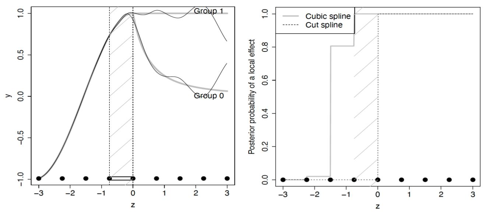

---

## Correlated data setting

If $\Sigma \neq \sigma^2 I$, then asymptotic solution becomes

$$\begin{align}
\tilde\eta^\star
&=
\underset{\eta}{\arg \min} E_F \left[  (y - W\eta)^T \Sigma^{-1} (y-W\eta) |Z, X   \right] \\
&=\left( W^T \Sigma^{-1} W \right)^{-1} W^T \Sigma^{-1} E_F (y | Z, X)  \\
&= \eta^\star + \left( W^T \Sigma^{-1} W \right)^{-1} W^T \Sigma^{-1} \left[ E_F (y | Z, X) - W \eta^\star \right]
\end{align}$$

--


- 2nd term unlikely to be 0, so $\tilde \eta^\star \neq \eta^\star$


- we can't ignore correlated errors!


---
## Accounting for Dependence

Estimate $\hat\Sigma$, and coerce a block-diagonal structure.

- reasonable when long-range dependence is weak

Then modify:

$$\tilde{y} | Z, X, \hat\Sigma  \sim  N(\tilde W_0 \eta_0 + \tilde W_1 \eta_1, \sigma^2 I)$$
Where
- $\tilde y = \hat \Sigma ^{-1/2}y$
- $\tilde W_0 = \hat \Sigma ^{-1/2} W_0$
- $\tilde W_1 = \hat \Sigma ^{-1/2} W_1$


???
found first order autoregressive or moving average models typically worked well, selecting preferred model based on BIC


---

## Bayesian framework for local null testing

- testing the effect of covariate $j$ in region $R_b, b \in \{ 1, ..., |\mathcal{R}| \}$ is equivalent to testing $\eta_{1jb} \neq 0$, resulting in a total of $p \times |\mathcal{R}|$ tests.

- we employ model vectors $\gamma = \{ \gamma_{jb} \}$, where $\gamma_{jb} = I(\eta_{jb} = 0)$

- The goal is then to select the optimal model $\gamma^\star$ where $\eta^\star$ is chosen to minimize MSPE under $F$

- $\gamma^\star$ represents the optimal model among those under consideration.

  - "optimal" = smallest among those models that are KL closest to $F$ (Rossell, 2022)

- under mild regularity conditions, $p(\gamma^\star | y) \rightarrow 1$ as $n \rightarrow \infty$

???
thus the marginal posterior concentrates on $\gamma_{bj}^\star}$ uniformly across pairs (j,b).

---
## Model probabilities & PIPs

By placing a proper prior on models, we obtain valid posterior inference even though we are considering many models:

  - the posterior probabilty of model $\gamma$ is:

$$p(\gamma| y) = \frac{  p(y| \gamma) p(\gamma)  }{  \sum_{\gamma'} p(y| \gamma') p(\gamma')  }$$
  - we then obtain the __marginal posterior inclusion probabilities__ for each region: $$p(\gamma_{jb} = 1 | y) = \sum_{\gamma: \gamma_{jb} = 1} p(\gamma | y)$$


???

The major advantages of using Bayesian machinery stem from being able to put a prior on models.


posterior probabilities adjust for multiplicities (Mueller, Parmigiani, Rice 2006)


---
## Priors

### $\eta$
- for independent data, Normal shrinkage prior works fine:
$$p(\eta_\gamma | \gamma) = N \left(\eta_\gamma | 0, g \cdot \text{diag}(W_\gamma^T W_\gamma/n) ^ {-1} \right)$$
  - $g>0$ prior dispersion parameter.  By default, $g = 1$, yielding the unit information prior.

--

- for dependent data, a group pMOM prior (Rossell, 2021) used.
  - non-local prior pushes sparsity a bit better.
  - penalizes groups with small contributions relative to model size

???
also considered ICAR prior (Besag 1974) - intrinsic conditionally auto-regressive prior
- but similar results


---
## Priors

### $\gamma$: Model prior:

__Complexity prior__ (Castillo, 2015)

$$p(\gamma) = \frac{C}{q^{c |\gamma|_0}} \times {q \choose |\gamma|_0}^{-1} I( |\gamma|_0 \in \{ 0, ..., \bar q\}$$

- $q$ is the total number of parameters
- $c \geq 0$ is a hyperparameter, $C$ is the normalizing constant.
  - $c$ = 0 $\rightarrow$ Betabinomial prior (discrete uniform on model size)
  - $c > 0$, prior probabilities decay with model size.


---
## Multi-resolution Analysis

.pull-left[
Bayesian Model Averaging provides a natural framework to consider multiple resolutions

- just need to place a prior on the resolutions

- Posterior probabilities of an effect at $z$:

$$\begin{align}
&p(\beta_j(z) \neq 0 | y) = \\
&\sum_{l=1}^L p(\beta_j(z) \neq 0 | y, \mathcal{R}_l) p(\mathcal{R}_l | y)
\end{align}$$

]

.pull-right[
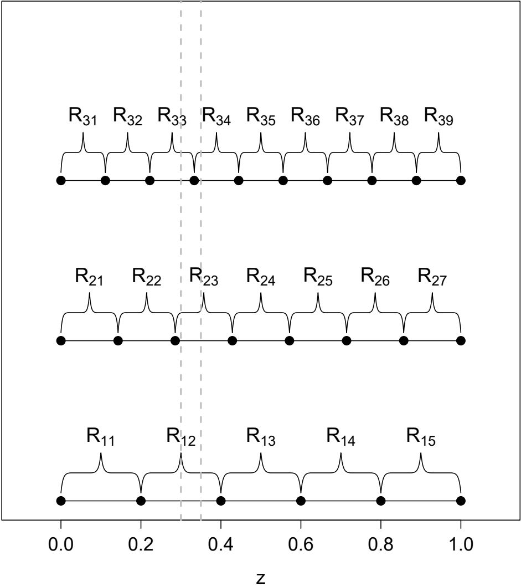
]


???
computation can be done in parallel across different resolutions

---

## Simulation results: Independent errors

- comparison of Gaussian shrinkage prior and ICAR prior with cut orthogonal splines, VC_BART, and the `gam` function from mgcv (additive model with generalized cross-validation; provides simultaneous 95% confidence bands; 12 and 24 knots)

- p = 10 covariates, cubic B-spline with 20 knots for the baseline, and a multi-resolution analysis involving 7, 9, and 11 knots to evaluate covariate effects

- covariate $x_{i1}$ is a binary group indicator with equal group sizes

- covariates 2-10 are $x_{ij} \sim N(x_{i1}, 1)$ (inducing correlation between covariates)

- expected outcome depends truly only on the first covariate

- 100 replicates


---
## Simulation results: Independent errors

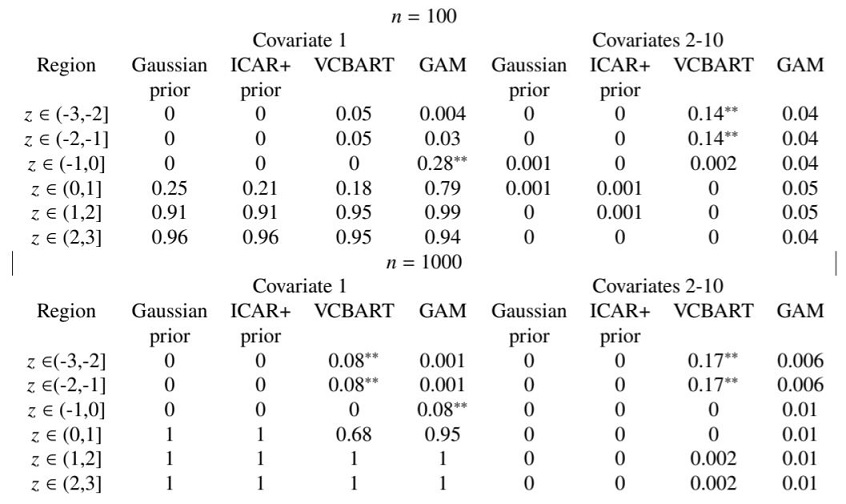


???

- for Covariate 1, before time 0 = Type 1 error, after time 1 = power
- everything else is type 1 error


---
## Simulation results: Independent errors


.panelset[
  .panel[.panel-name[n100]
    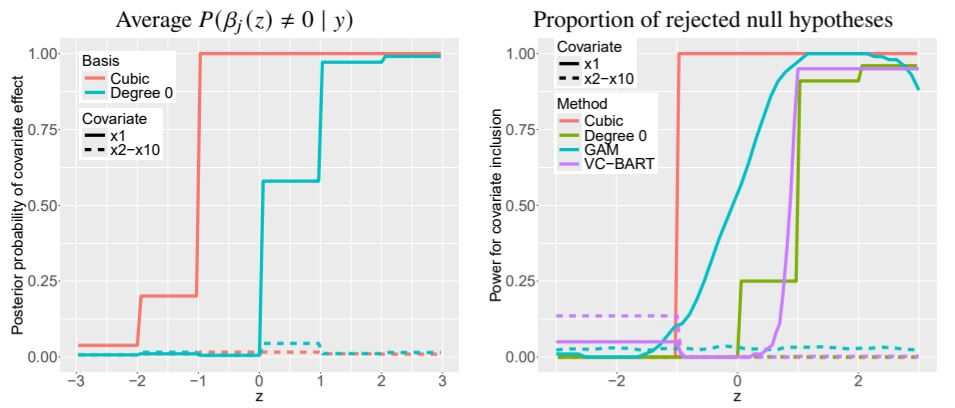
  ]

  .panel[.panel-name[n1000]
    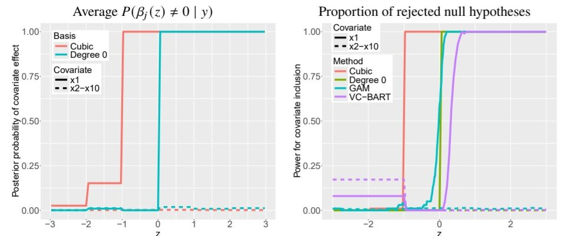
  ]
]


???
type 1 error in VC-BART


---
## Simulation results: Independent errors

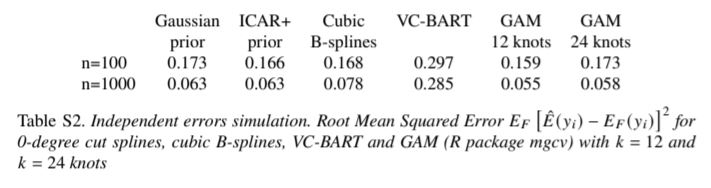

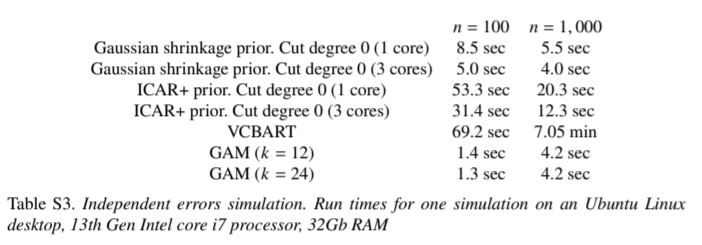


---
## Simulation results: Dependent errors

- comparison to the tensor model method of Paulon et al 2022, Interval Testing procedure (IT; Pini and Vantini 2016), and VC_BART.

- grid of 100 time points for 50 individuals, $p$ = 10.

- strongly correlated errors
  - errors drawn from mean 0, unit variance Gaussian process with autocorrelation $\text{cov}(\epsilon_{it}, \epsilon_{it'}) = 0.99^{|t - t'|}$


???

Bayesian Semiparametric Hidden Markov Tensor Models for Time Varying Random Partitions with Local Variable Selection
Giorgio Paulon, Peter Müller, Abhra Sarkar


---
## Simulation: Dependent errors (univariate)


---
## Simulation: Dependent errors (multiple covariates)


???

  - LFMM had type 1 error > 0.5 for multiple covariates simulation
  - IT procedure can handle only a single covariate


---
## ECoG data

Considered 4 covariates related to game outcomes:

1. choosing to gamble

2. win/loss

3. reward prediction error (RPE)

4. regret

- additional covariates regarding previous round

- multi-resolution analysis: 10, 20, 30, 37 knots

???
37 knots ---> 50 ms
RPE - difference between obtained reward/loss and expected value of the gamble
- Here, we present results from one brain region from one patient (p5 e29)


---
## ECoG data

.panelset[

.panel[.panel-name[Win/Loss & RPE]


]

.panel[.panel-name[Regret & Gamble]


]

]


???

Model effect of each covariate separately:
- found increases in HFA activity associated with game wins, higher RPE, and regret
- not with the choice to gamble


---


---
## Salary data

- multiresolution analysis: 4, 10, 15 and 20 regions (12-year bins to 2.5-year bins)

- examined effects of race, gender, college degree, government-employed, self-employed

- included occupational sector as adjustment variable (no selection)


???

- conditioned on occupational sector
- highest post prob was for 10-yr bins


---
## Salary data results


???

- blackness, gender and college education have posterior prob near 1 for any age
  - estimated to be smaller below age 30

- less evidence of salary gap associated with identifying as Hispanic _for recent entrants to workforce_, but strong evidence at other ages.


- for reference,
10^-0.05 ~ 0.891
10^-0.1 ~ 0.794
10^-0.16 ~ 0.708


???
analyzed together; only regret has high inclusion probability

- overall, findings support that this brain region is associated with outcome-related covariates (gamble win, regret) rather than choice-related process (gamble choice)


Local null testing found strong evidence of wage gaps (if all other characteristics the same) for
- black vs non-black workers,
- female vs male workers,
- college degree holders vs. non-college degree holders,
- government vs. wage/salary private sector workers ages 30-40 ;

And little evidence of wage gaps for
- self-employed vs wage/salary private sector workers across ages,
- Hispanic vs non-Hispanic workers below age 30.


---
class: left, inverse, middle

# BFDR-controlled Variable Selection with Horseshoe Deep Neural Networks

---
## Motivation:

Local null testing allows us to test for localized effects, but the cut basis produces crude estimates of the actual trajectories.

### Desiderata:

- Still want to be able to identify active variables;  

  - (with control over BFDR and FDR)  

- Flexibly model varying, non-linear relationships;  

- Ability to model _granularly_, i.e. learn forms that may differ within subcategories.


???
- Local null testing is great at capturing whether local effects exist, but not so great at modeling/estimating the actual functional forms of these effects (limited by the basis).

- motivated by recognizing that wage gaps are likely to take on different forms based on __interactions__ between variables.  

- For example, in the salary data: 

  - black, non-Hispanic females with college degrees in healthcare vs. sales, 
  
  - non-black Hispanic males without college degrees in office positions vs. those without college degrees

__We want a more flexible modeling approach that captures the varying effect of (any order of) interactions implicitly while still identifying the truly active set__


---
## DNNs

DNNs map inputs $\mathbf{x} \in \mathbb{R}^p$ to output $\hat{y} = f(\mathbf x)$ via composition of affine transformations and non-linearities:

$$f(\mathbf{x}) = \sigma_{L-1}\left(\,\sigma_{L-2}\!\left(\cdots       \sigma_1(\mathbf{x}W_1  + \mathbf{b}_1') \cdots     \right)W_{L-1} + \mathbf{b}_{L-1}'\right)W_L + b_L'$$
- $L$ = number of layers
- $W_\ell \in \mathbb{R}^{d_{\ell-1} \times d_{\ell}}$, weight matrix in layer $\ell$;  
- $\mathbf{b}_\ell \in \mathbb{R}^{d_\ell}$ bias vector at layer $\ell$
- $\sigma_\ell(\cdot)$ the nonlinear activation function applied in layer $\ell$ 

___

--

- Extremely flexible (universal function approximator property)

- Discover interactions / patterns without manual specification


???
- $d_0 = p$  

- frame DNN as attractive choice for non-parametric modeling, discovering interactions/patterns.  What ML people call feature engineering not as important (e.g. don't need to specify interactions).

- Why not just use trees?  Trees are not as scalable, and, as we will see, overfits training data with larger $n$.  Also, our model has potential applications to less structured data (i.e. images --- which pixels are important?)


---
## Deterministic vs. Bayesian NN's

.pull-left[
__Deterministic NN:__

- Network parameters are the weights in each layer $\{w_{j,k}\} = W$, which are __point estimates__ $\rightarrow$ __no uncertainty quantification.__
]

.pull-right[
__Bayesian NN:__

- Network parameters are the __parameters of the weights' distributions__, i.e. if $w_{j,k} \sim N(\mu_{w_{j,k}}, \sigma^2_{w_{j,k}}$), the network parameters are $\mu_{w_{j,k}}, \sigma_{w_{j,k}}$
]

--

.pull-left[

- Prone to overfitting

- Variable selection?

]

.pull-right[
- Built-in regularization via priors

- Variable selection via prior specification
]


???
- Bayesian NNs perform the same mapping as before, BUT

- uncertainty quantification can be obtained (most common method is dropout) --- but might as well be Bayesian then (Kingma 2015, Gal & Gahramani 2016) show dropout can be formulated as special cases of Bayesian regularization.

- can apply regularization and variable selection methods to deterministic methods, such as LASSO (LASSOnet), but suffers the same issues as regular LASSO (uncertainty quantification not direct, tends to suffer under correlated variables).


---
## Bayesian Compression algorithm

.lcode[
- Louizos, Ullrich, Welling (2017) apply Bayesian group sparsity prior to __rows__ of neural network weights

- their goal: reduce matrix size for edge computing

]

 
.rplot[ 
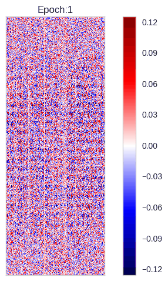  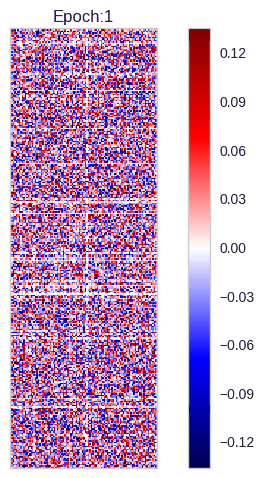 
]

???
- their focus, as in most ML literature dealing with any kind of selection, is on architecture selection and compression.

I want to repurpose for variable selection (input feature selection), BUT RETAIN control over BFDR and FDR
- precursors:
  - ARD (automatic relevance determination) of Neal and MacKay (90s) - basically, one-scale continuous shrinkage, dropout parameter
  - dropout (random zeroing out of weights) and variational dropout
  - combining the two leads to Bayesian formulation for __structured__ sparsity


---
## matrix reduction $\rightarrow$ variable selection

- eliminating rows in the input layer yields variable selection:


$$\underset{\mathbf{X}_{n \times p}}  {  \begin{array}{ccccc}         \square \square \square \square \\         \square \square \square \square \\       \end{array}}     \times   
\underset{\mathbf{W}_{p \times d_1}} {   \begin{array}{ccccc}         \square \square \square \square \square \square \square\\         \square \square \square \square \square \square \square\\         \square \square \square \square \square \square \square\\         \square \square \square \square \square \square \square\\       \end{array} }     + \mathbf{b'_{d_1}}     = \underset{\mathbf{H}_{n \times d_1}} {  \begin{array}{ccccc}         \square \square \square \square \square \square \square\\         \square \square \square \square \square \square \square\\     \end{array}}$$

???
- Departing from usual CS / ML convention flipping x and W. (WHY DO THEY DO THIS? CAUSES SO MUCH CONFUSION) - because I tend to think of these as stacks of linear models

- so if we eliminate the third row of weights....


---
## matrix reduction $\rightarrow$ variable selection

- eliminating rows in the input layer yields variable selection:


$$\underset{\mathbf{X}_{n \times p}}  {  \begin{array}{ccccc}         \square \square \square \square \\         \square \square \square \square \\       \end{array}}     \times     \underset{\mathbf{W}_{p \times d_1}} {   \begin{array}{ccccc}         \square \square \square \square \square \square \square\\         \square \square \square \square \square \square \square\\         \blacksquare \blacksquare \blacksquare \blacksquare \blacksquare \blacksquare \blacksquare\\         \square \square \square \square \square \square \square\\       \end{array} }     + \mathbf{b'_{d_1}}     = \underset{\mathbf{H}_{n \times d_1}} {  \begin{array}{ccccc}         \square \square \square \square \square \square \square\\         \square \square \square \square \square \square \square\\     \end{array}}$$


???
Then we eliminate the 3rd input column (i.e. covariate $x_3$)


---
count: false
## matrix reduction $\rightarrow$ variable selection

- eliminating rows in the input layer yields variable selection:


$$\underset{\mathbf{X}_{n \times p}}  {  \begin{array}{ccccc}         \square \square \blacksquare \square \\         \square \square \blacksquare \square \\       \end{array}}     \times     \underset{\mathbf{W}_{p \times d_1}} {   \begin{array}{ccccc}         \square \square \square \square \square \square \square\\         \square \square \square \square \square \square \square\\         \blacksquare \blacksquare \blacksquare \blacksquare \blacksquare \blacksquare \blacksquare\\         \square \square \square \square \square \square \square\\       \end{array} }     + \mathbf{b'_{d_1}}     = \underset{\mathbf{H}_{n \times d_1}} {  \begin{array}{ccccc}         \square \square \square \square \square \square \square\\         \square \square \square \square \square \square \square\\     \end{array}}$$
???

This idea (matrix reduction = variable selection) actually has a long history

- Radford Neal 90’s ARD: scale-mixture shrinkage, single parameter estimated via Empirical Bayes (likelihood maximization).  

  - HAD STRUCTURE — applied to the weights tied to inputs, like us  
  
  - variational dropout - not necessarily structured like this, but makes ARD scalable with VI  
  


---
count: false
## matrix reduction $\rightarrow$ variable selection

- eliminating rows in the input layer yields variable selection:


$$\underset{\mathbf{X}_{n \times p}}  {     \begin{array}{ccccc}            \square \square \blacksquare \square \\             \square \square \blacksquare \square \\           \end{array}}        \times       
\underset{\mathbf{W}_{p \times d_1}} {      \begin{array}{ccccc}            \square \square \square {\blacksquare} {\blacksquare} \square \square\\             \square \square \square {\blacksquare} {\blacksquare}  \square \square\\            \blacksquare \blacksquare \blacksquare {\blacksquare} {\blacksquare} \blacksquare   \blacksquare\\            \square \square \square {\blacksquare} {\blacksquare} \square \square\\           \end{array} }         + \mathbf{b'_{d_1}}         = \underset{\mathbf{H}_{n \times d_1}} {     \begin{array}{ccccc}            \square \square \square {\blacksquare} {\blacksquare}\square \square\\            \square \square \square {\blacksquare} {\blacksquare}\square \square\\        \end{array}}$$


- eliminating rows in the next layer yields _column_ / representation sparsity


???
column / node / representation sparsity --- more parsimonious model, easier to interpret.  Helps us out later as well.

  - Bayesian Compression (Louizos, Ullrich, Welling) - follow variational dropout tradition (Normal-Jeffrey’s), though they do also try the HShoe.


---
## Scale-Mixture priors

One way to formulate variable selection is by using a scale-mixture prior:

$$\beta_j | \lambda_j \sim N(\beta | 0, \lambda_j^2); \qquad \lambda_j \sim p(\lambda_j) $$

--

Canonical choices for $p(\lambda_j)$:

- Bernoulli($\pi_j$) $\rightarrow$ Discrete Spike-and-Slab (the "gold standard" for variable selection)

- Double-Exponential $\rightarrow$ Bayesian LASSO

- improper $p(\lambda) \propto 1/\lambda$ $\rightarrow$ Normal-Jeffrey's

- __Half-Cauchy $\rightarrow$ Horseshoe__


???
- skippable if needed  

- seems innocuous / conventional / unthreatening, but placing structure on $p(\lambda)$ $\rightarrow$ marginal prior dist'ns for $\beta$ with more __mass at 0 and in tails__ $\rightarrow$ bias posterior $\beta$'s to be either very small or large.  

- e.g. Bernoulli prior on $\lambda$ $\rightarrow$ Spike-and-Slab  

- __important to note (if haven't yet)__ Discrete Spike-and-Slab considered the gold standard for Bayesian Variable Selection --- posterior Bernoulli probabilities are the posterior inclusion probabilities

- Bayesian LASSO --- MAP (maximum a posteriori or posterior mode) estimate equivalent to Freq.y LASSO  

- problems with Normal-Jeffrey's --- Hron et al next year show that NJ prior induces pathologies in training.  Dropout params all go to 0.


---
## Horseshoe Prior


$\beta_j | \lambda_j, \tau \sim N(0, \lambda_j^2 \tau_j^2), \qquad  \lambda_j \sim C^+(0, 1), \qquad \tau \sim C^+(0, \tau_0)$

- $\lambda_j > 0$ is _local_ scale for $j$'th coefficient

- $\tau > 0$ is _global_ scale governing overall sparsity level

    
&nbsp;
___


--


A key summary statistic is the __shrinkage weight__ $\kappa_j$
$$\kappa_j = \frac{1}{1 + \lambda_j^2 \tau^2} \;\in\; (0, 1)$$


???
- important to remember these interp.s are __predicated on linear model setting__:  

  - local scale $\lambda_j$ applies to the coefficient for $x_j$.  Cauchy places significant mass near 0 while also having heavy tails.  Local scale parameter allows individual coefs to "escape" global shrinkage.
  
  - global scale $\tau$ applies to the coefficient vector

- we'll have to recover this interpretation from the NN setting.

---
### Shrinkage Profile

.lcode[

- shrinkage profiles for $\kappa_j$ under different priors

- horseshoe exerts strong pressure for $\kappa_j \rightarrow 0$ or $1$

- image from Carvalho, Polson, Scott 2009, "Handling Sparsity via the Horseshoe"
]

.rplot[
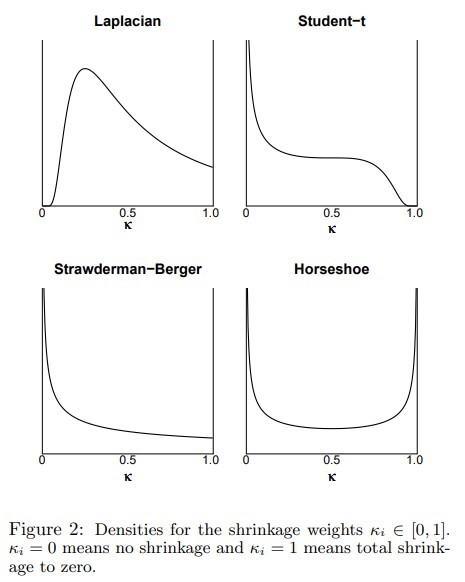
]

---
### $\kappa_j$ as pseudo-PIPs

_Bhadra et al 2019_ show that in a linear regression context, asymptotically, 

$$\mathbb{E}[\beta_j \mid \mathbf{y}]    \;\approx\;   \bigl(1 - \mathbb{E}[\kappa_j \mid \mathbf{y}]\bigr)\,    \hat{\beta}_j^{\mathrm{OLS}}$$

- $1 - \mathbb{E}[\kappa_j \mid \mathbf{y}]$ is analogous to BMA weight for coefficients under discrete spike-and-slab

- $1 - \kappa_j$ can be interpreted as a "pseudo"-Posterior Inclusion Probability ($PIP_j$) for variable $x_j$ (_Carvalho, Polson, Scott 2010_)

___

--


_Piironen & Vehtari 2017_ also use $\kappa_j$ to describe the __"effective number of coefficients"__ $(m_\text{eff})$ in a model:
$$m_\text{eff} = \sum_{j=1}^p (1 - \kappa_j)$$


???

- __important to note (if haven't yet)__ Discrete Spike-and-Slab considered the gold standard for Bayesian Variable Selection --- posterior Bernoulli probabilities are the posterior inclusion probabilities

- We can use these PIPs to control the BFDR $\rightarrow$ if PIPs well-calibrated $\rightarrow$ control the FDR!

- $1 - \mathbb{E}[\kappa_j \mid \mathbf{y}]$ is essentially the weight assigned to OLS estimate in Bayesian Model Averaging


- effective number of coefs will come back!!


---
## Model

- We assume the data-generating truth relates the outcome $\mathbf{y} = (y_1, \ldots, y_n)^\top \in \mathbb{R}^n$ to some active subset of covariates $\mathbf{X}^\star \subseteq \mathbf{X} \in \mathbb{R}^p$ through an unknown function $f^\star$.

- Assuming i.i.d. normally-distributed noise, the model is

$$y_i \sim N \left( f^\star (\mathbf{x}_i), \sigma_\varepsilon^2 \right).$$

<!-- ___ -->

<!-- -- -->

<!-- We choose to model $f^\star(x_i)$ with a feedforward neural network $f(\mathbf{x}_i, \{\mathbf{W}^{(\ell)}\}^L_{l=1})$ -->

<!-- - $\{\mathbf{W}^{(\ell)}\}^L_{l=1}$ denotes the collection of $L$ weight matrices -->


---
## NN representation

We propose modeling $f^\star(\mathbf{x}_i)$ using a feedforward neural network with $L$ layers, denoted $f(\mathbf{x}_i, \{\mathbf{W}^{(\ell)}\}^L_{\ell=1})$, each layer containing $d_1, \ldots, d_\ell$ nodes:

$$\begin{aligned}
    \hat{y}_i 
        & = f(\mathbf{x}_i, \{\mathbf{W}^{(\ell)}\}^L_{\ell=1}) \\
        & = \mathbf{h}_i^{(\ell-1)} \mathbf{W}^{(\ell)} + \mathbf{b}^{(\ell)},
        \qquad
        & {\mathbf{h}}_i^{(\ell)}
        = \sigma^{(\ell-1)}\!\left({\mathbf{h}}_i^{(\ell-1)} \mathbf{W}^{(\ell)} + \mathbf{b}^{(\ell)} \right),  
\end{aligned}$$

- $\mathbf{h}_i^{(\ell)} \in \mathbb{R}^{d_\ell}$ is the output vector of activations for layer $\ell$ 
(and $\mathbf{h}_i^{(\ell=0)} = \mathbf{x}_i$), 

- $W^{(\ell)} \in \mathbb{R}^{d_{\ell-1} \times d_{\ell}}$ and $\mathbf{b}^{(\ell)} \in \mathbb{R}^{d_\ell}$ the weight matrix and bias vector at layer $\ell$

- $\sigma^{(\ell)}(\cdot)$ denotes the layer activation function (RELU).

???
- skippable if needed


---
## Bayesian model: Grouped Horseshoe

Our Bayesian model for the weight distributions use a _structured_ Horseshoe prior:

$$\begin{aligned}
        y_i | \mathbf{x}_i, \{\mathbf{W}^{(\ell)}\}^L_{l=1}
          & \sim N\left( f(\mathbf{x}_i, \{\mathbf{W}^{(\ell)}\}^L_{l=1} ), \sigma_\varepsilon^2 \right)
        \\
        \{\mathbf{W}^{(\ell)}\}^L_{l=1}  | \lambda, \tau
          & \sim 
          \prod_{\ell \in \{1, 2, ..., L\}}
          \prod_{
          \substack{
            j \in \{1, 2, .., d_{\ell-1}\}, \\ 
            k \in \{1, 2, ... d_\ell\}}
          } 
          N(w^{(\ell)}_{j,k} | 0, \lambda^{(\ell)2}_{j} \tau^{(\ell)2})
        \\
        \lambda^{(\ell)}_j 
          & \sim C^+ (0, 1), \qquad
        \\
        \tau^{(\ell)} 
          & \sim C^+ (0, \tau_0)
  \end{aligned}$$

- local scale parameter $\lambda_j$ shared by all weights in __row $j$, i.e. all weights connecting to $j$'th input__.

???

- mostly spend time on second line

- assigning each weight its own $\lambda_{j,k}$ would lead to __unstructured__ sparsity.  Instead, every weight in a row (i.e. same coef in each layer unit) shares the same local scale parameter induces __input__ sparsity.


---
### reparameterization

__Cauchy decomposition:__
- Cauchy is hard to approximate with standard exponential families (helpful for VI).  


$$\begin{aligned}
    &\lambda_j^2 = \alpha\beta;  
        &\quad \alpha_j \sim \text{Gamma} (1/2, 1); 
        &\quad \beta_j \sim \text{inv-Gamma} (1/2, 1)
    \\
    &\tau^2 = a b;
        &\quad a \sim \text{Gamma} (1/2, \tau_0^2); 
        &\quad b \sim \text{inv-Gamma} (1/2, 1)
\end{aligned}$$

___

--
__uncentered parameterization:__

- individual weight distribution: $w_{j,k} \sim N(w_{j,k} | 0, \lambda^2_{j} \tau^2)$ 

- can be rewritten as $w_{j,k} = \tilde{w}_{j,k} \lambda_j \tau = \tilde{w}_{j, k} \sqrt{\alpha_{j} \beta_{j} a b}$, where $\tilde{w} \sim N(0,1)$

--


???
- prep for VI: Thick tails of Cauchy resist approximation by standard exponential families

- sampling $w_{j,k}$ conditional on tau and lambda in MCMC is known (Michael Betancourt, one of the developoers of STAN) to lead to funnel-shaped posterior geometries (trapping the MCMC).  In MCMC, posterior dependence arrives via the likelihood.  In VI, we also avoid conditional sampling and can just draw each of these independently of each other.


---
## Variational Inference

In Variational Inference (VI), the (often intractable, difficult to sample) posterior $p(W | D)$ is approximated by the variational distributions $q_\phi(W)$.  

--

- The goal is to minimize the (reverse) Kulback-Leibler Divergence (KL)

$$KL \left(q_\phi(W) || p(W|D) \right) = E_{q_{\phi}(W)}\left[ \log\left(\frac{q_\phi(W)}{p(W|D)} \right)  \right].$$


???
- $\phi$ are the VI parameters.

- calculating the KL requires knowing $p(W|D)$, which is precisely the thing we're saying is hard.  So....

- __IF TIME:__ one nice interpretation of the KL comes from information theory: 

 - the negative log-density can be thought of the "information content", or how surprised we should be to see a random variable take on a particular value.  

  - I.E. the log-density ratio in the reverse KL here $\log\left(\frac{q_\phi(W)}{p(W|D)} \right)$ is how surprised we would be by a receiving a W from the posterior if we think that the actual distribution is $q_\phi(W)$.  Then we take the expectation of this surprise over $q_\phi(W)$. 


---
count: false

## Variational Inference

In Variational Inference (VI), the (often intractable, difficult to sample) posterior $p(W | D)$ is approximated by the variational distributions $q_\phi(W)$.  


- The goal is to minimize the (reverse) Kulback-Leibler Divergence (KL)

$$KL \left(q_\phi(W) || p(W|D) \right) = E_{q_{\phi}(W)}\left[ \log\left(\frac{q_\phi(W)}{p(W|D)} \right)  \right].$$


In practice, we maximize the Evidence Lower Bound (ELBO)
$$\mathcal{L}(\phi) =    \mathbb{E}_{q_\phi} \left[ \log p(\mathcal{D}|\mathbf{W}) \right]      - KL \left( q_\phi(\mathbf{W})||p(\mathbf{W}) \right).$$
--

Maximizing the ELBO minimizes $KL \left(q_\phi(W) || p(W|D) \right)$ because the marginal log likelihood of the data (also called the __model evidence__) is

$$\log p(D) = \mathcal{L}(\phi) + KL \left(q_\phi(W) || p(W|D) \right).$$


???

- ELBO terms: 
  - Expected log-likelihood of the data under the variational distribution (which we use samples for) minus the "distance" between the variational posterior approximation $q_phi(W)$ and the prior $p(W)$ 

- Easy to derive expression for marginal evidence by starting from KL(q||p(W|D)) and applying Bayes' Rule to p(W|D)

- __notice that the variational posterior distributions stay independent of each other.  For this reason VI is known to underestimate posterior variance.__

---
### Variational parameterization

Our (decomposed, uncentered) model for one layer can be written:

$$\begin{aligned}
  \{\mathbf W\} &= \left \{w_{i,j} = \tilde{w}_{j, k} \sqrt{\alpha_{j} \beta_{j} a b} \right \}; & \tilde{w}_{j, k} & \sim N(0,1)
  \\
  \alpha_j &\sim \text{Gamma} (1/2, 1); 
            &\beta_j &\sim \text{inv-Gamma} (1/2, 1)
  \\
  a &\sim \text{Gamma} (1/2, \tau_0^2); 
            & b &\sim \text{inv-Gamma} (1/2, 1) 
\end{aligned}$$

--

We assign a Normal variational distribution to $\tilde{w}_{j,k}$ and log-Normal variational distributions to $\alpha_j, \beta_j, a, b$.

$$\begin{aligned}
  q_\phi\left(a, b, \tilde{\mathbf W}_{j,k}\right)
    &= 
        \mathcal{LN}\!\left(a | \mu_{a},\, \sigma_{a}^2\right)
        \mathcal{LN}\!\left(b | \mu_{b},\, \sigma_{b}^2\right)
        \prod_{j,k}^{d_{\ell-1}, d_\ell}\mathcal{N}\!\left(\tilde{w}_{j, k} | \mu_{j,k},\, \sigma_{j,k}^2\right)
    \label{eq: abw-dists}
    \\
  q_\phi(\mathbf{\alpha}, \mathbf{\beta})
    &= 
        \prod_{j}^{d_{\ell-1}}
            \mathcal{LN}\!\left(\beta_j | \mu_{\alpha_j},\, \sigma_{\alpha_j}^2\right)
            \mathcal{LN}\!\left(\alpha_j | \mu_{\beta_j},\, \sigma_{\beta_j}^2\right)
\end{aligned}$$

???
$\phi$ = the $\mu$'s and $\sigma$'s of the variational distributions.

---
## Corrections for Inference: problems with $\tau$


In linear models, $\tau$ controls the overall sparsity 
--
_in a vector of coefficients, each corresponding to an $x_j$._

--

And the contribution of $x_j$ to $y$ is encapsulated by $\beta_j x_j$, i.e. fully described by the coefficient.

--

This isn't the case for us.  
  
- We have a __matrix__ of coefficients, with $d_\ell$ of them corresponding to a single $x_j$.  Each of the $d_l$ nodes captures __a different representation__ of the input variables.  Output of layer is also shrunk by horseshoe in next layer.


???

- I don't think there is a problem inherent in that $d_l$ coef's correspond to each $x_j$, since the _proportion_ of coefs corresponding to each $x_j$ to the overall number of coefs is the same.  The bigger problem is that each of the $d_l$ nodes are _trying to capture different characteristics_ (why DNNs can predict so well), and thus giving the $d_l$ coefs different weightings.  Furthermore, 2nd layer shrinks some nodes as well!

- Also, shrinkage from the 2nd layer exacerbates the previous point, i.e. some nodes are contributing less than others.  Overall, shrinkage from the 2nd layer is arguably helpful, reducing overall dimension, providing sparser representations, mitigating identifiability issues.  __It also offers a solution,__ as we will see. 

- __Next slide__ Instead, output from the first layer (which supplies the parameters for inference on variable selection) has to travel through the rest of the network.

---
count: false
## Corrections for Inference: problems with $\tau$


In linear models, $\tau$ controls the overall sparsity 
_in a vector of coefficients, each corresponding to an $x_j$._


And the contribution of $x_j$ to $y$ is encapsulated by $\beta_j x_j$, i.e. fully described by the coefficient.


This isn't the case for us.  
  
- We have a __matrix__ of coefficients, with $d_\ell$ of them corresponding to a single $x_j$.  Each of the $d_l$ nodes captures __a different representation__ of the input variables.  Output of layer is also shrunk by horseshoe in next layer.


- The contribution to $y$ of each covariate $x_j$ is __not fully described__ by that matrix.  Subsequent layers can amplify or attenuate that contribution. 

???

- I don't think there is a problem inherent in that $d_l$ coef's correspond to each $x_j$, since the _proportion_ of coefs corresponding to each $x_j$ to the overall number of coefs is the same.  The bigger problem is that each of the $d_l$ nodes are _trying to capture different characteristics_ (why DNNs can predict so well), and thus giving the $d_l$ coefs different weightings.  Furthermore, 2nd layer shrinks some nodes as well!

- Also, shrinkage from the 2nd layer exacerbates the previous point, i.e. some nodes are contributing less than others.  Overall, shrinkage from the 2nd layer is arguably helpful, reducing overall dimension, providing sparser representations, mitigating identifiability issues.  __It also offers a solution,__ as we will see. 

- Instead, output from the first layer (which supplies the parameters for inference on variable selection) has to travel through the rest of the network.


---
### $\tau^{(1)}$ correction $m^{(2)}_\text{eff}$

In order to use $\kappa_j$ as a posterior inclusion probability, we need to recover an interpretation of $\tau^{(1)}$ as controlling the overall __input__ sparsity. 

--

One way to estimate the effect of the __global sparsity__ induced by $\tau^{(1)}$ is to ignore the local shrinkage (set all $\lambda_j = 1$).  Then we might call

$$g_\text{eff} = \sum_{j=1}^p \sum_{k=1}^{d_1} \left( 1 - \frac{1}{1 + \tau^2} \right) = d_1 \times p \times \left( 1 - \frac{1}{1 + \tau^2} \right)$$
the _effective number of weights_ in $\mathbf{W}^{(1)}$ resulting from sparsity induced by $\tau^{(1)}$


???
Essentially, we need to separate $\tau^{(1)}$'s contribution to global sparsity in the matrix $\mathbf{W}^{(1)}$ into input (row) and representation (column) sparsity.

- We're going to rely heavily on Piironen & Vehtari's concept of $m_{eff}$ to do this.


---
### $\tau^{(1)}$ correction $m^{(2)}_\text{eff}$

In order to use $\kappa_j$ as a posterior inclusion probability, we need to recover an interpretation of $\tau^{(1)}$ as controlling the overall __input__ sparsity. 


One way to estimate the effect of the __global sparsity__ induced by $\tau^{(1)}$ is to ignore the local shrinkage (set all $\lambda_j = 1$).  Then we might call

$$g_\text{eff} = \sum_{j=1}^p \sum_{k=1}^{d_1} \left( 1 - \frac{1}{1 + \tau^2} \right) = d_1 \times p \times \left( 1 - \frac{1}{1 + \tau^2} \right)$$
the _effective number of weights_ in $\mathbf{W}^{(1)}$ resulting from sparsity induced by $\tau^{(1)}$

--

Rearrangement yields $\tau^{(1)} = \sqrt{\dfrac{g_\text{eff}}{d_1 \times p - g_\text{eff}}}$

???
- So we have an estimate of the global sparsity. 

- Now we need to separate this into __input__ and __representation__ sparsity, or row/column sparsity.

---
### Separating out representation sparsity

- 2nd layer provides __representation sparsity__ by shrinking layer 1 node outputs.

- We can estimate the _effective number of inputs_ to layer $\ell$ using
$$m^{(\ell)}_\text{eff} = \sum_{j=1}^{d_{\ell-1}} (1-\kappa^{(\ell)}_j)$$
--

- Since inputs to layer $\ell$ come from the nodes of layer $\ell-1$, it is equivalently the _effective number of nodes in layer $\ell-1$_

--

Thus the portion of $g_\text{eff}$ attributable to __input sparsity__ is 
$$m^{(2)}_\text{eff} \times p \times \left( 1 - \frac{1}{1 + \tau^2} \right).$$

???

- i.e. $m^{(2)}_\text{eff}$ is the effective number of nodes in layer 1 __after accounting for representation sparsity__


---
### $m_\text{eff}^{(2)}$ correction

We would like some correction $c$ such that $\tau^{(1)} \times c = \sqrt{\dfrac{g_\text{eff}}{m_\text{eff}^{(2)} \times p - g_\text{eff}}}$

--

Rearrangement gives $c = \sqrt{ \dfrac{d_1\times p - g_\text{eff}}{m^{(2)}_\text{eff} \times p - g_\text{eff}}}$.  

Assuming a high global sparsity level (i.e. $g_\text{eff}$ small) yields $c \approx \sqrt{\dfrac{d_1}{m^{(2)}_\text{eff}}}$


--

Thus we propose correcting $\tau^{(1)}$ when composing $\kappa_j$ for inference:

$$\tau_{m_\text{eff}}^{(1)} = \tau^{(1)} \times \sqrt{\dfrac{d_1}{m^{(2)}_\text{eff}}}$$


---
### Mo $\tau$ Mo Problems:

If we expand  the uncentered parameterization, we can see a clear problem: $\tau^{\ell)}$ is only weakly identifiable.

--

Letting $\Lambda^{(\ell)} = \text{diag} (\lambda_1, \lambda_2, ...., \lambda_{d_{\ell-1}})$, and expanding the expression for the 3rd layer activation:

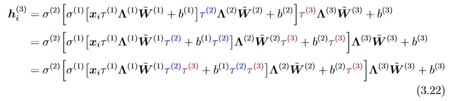

???
- __skippable if running short on time__

- The best Biggie song

- this problem (weak identifiability of $\tau$) is addressed by the 2nd correction, which corrects for __amplification / change in magnitude__

- since it's a scalar, $\tau$ can move across the RELU activation with little impediment. 

  - Only the intervening biases --- usually assigned very weakly informative priors --- have to change.  We partially mitigate this by assigning more informative priors N(0, .01) to the biases.

- __Other importnat thing to notice:__ this should make it clear that we can view the shrinkage parameters $\lambda$ and $\tau$ as applying to the weights / coefs just as much as the inputs


---
### $\tau$ correction: Composite Spectral Norm

One way to measure the "size" of a matrix $M$ is via its __spectral norm__, denoted $||M||_2$, or its largest singular value, measuring the maximum "stretch" of a unit-norm vector by $M$.

--

At inference time, we propose further correcting $\tau_{m_\text{eff}}$ by the __composite spectral norm__:

$$\tau_{\text{snm}}^{(1)} 
    = \tau_{m_\text{eff}}^{(1)} \times
        \left\| 
            \prod_{\ell=2}^L  \mathbf{W}^{(\ell)}
        \right\|_2 
    = \tau_{m_\text{eff}}^{(1)} \times       
        \left\|
            \prod_{\ell=2}^L
            \tau^{(\ell)} \mathbf{\Lambda}^{(\ell)} \tilde{\mathbf{W}}^{(\ell)}
        \right\|_2,$$


--

This addresses

- weak identifiability of $\tau^{(1)}$ 

- amplification of a $x_j$'s contribution to $\hat{y}$ by subsequent layer

- also __general__, i.e. can apply to downstream deterministic layers


???

- recall that in the linear model, the __effect of $x_j$ is fully described by $\beta_j$__.  We're trying to recover that.

- Is this a $\tau$ correction?  Maybe not (amplification argument applies equally to $\lambda_j$ and $\tau$)  It's a scalar though, and it does help with the identifiability issue for $\tau$.  

- Plus I get to call it the SNM correction instead of SN correction to kappa and $m_{eff}$ correction to tau.


---
## BFDR control procedure

Using $\hat{\kappa}_j   =   \frac{1}{S} \sum_{s=1}^{S} \frac{1}{1 + \lambda_j^{(s)2} \tau_{\text{snm}}^{(s)2 }}   =   \hat{\mathbb{E}}_{q_\phi}\!\left[\frac{1}{1 + \lambda_j^{2} \tau_{\text{snm}}^{2 }}\right],$

we test our method using the optimal BFDR control procedure of _Muller et al 2007_:

$$\begin{aligned}
\widehat{BFDR}(\eta)
    =
        \frac
            {\sum_{j=1}^p  \left(1-\widehat{PIP}_j  \right)
            \times
            \mathbb{I}\left(
                \widehat{PIP}_j > \eta
                \right)}
            {\sum_{i=1}^p 
            \mathbb{I}\left(
                \widehat{PIP}_i > \eta
                \right)}
    =
        \frac
            {\sum_{j=1}^p  \hat{\kappa_j}  \mathbb{I}\left(
                \hat{\kappa}_j < 1-\eta
                \right)}
            {\sum_{i=1}^p 
            \mathbb{I}\left(
                \hat{\kappa}_j < 1-\eta
            \right)}
\end{aligned}$$

--

- threshold $\eta$ is chosen via search over $(0,1)$; lowest $\eta$ keeping $\widehat{BFDR}(\eta)$ below the specified rate is chosen.

- optimal in the sense that it minimizes the False Negative Rate / maximizes power while still controlling the BFDR.


???
- $\hat{E}_{q_\phi}}(\kappa_j)$ determined by taking S samples from posterior (S=100 for us)

- this is essentially the Bayesian analogue to the frequentist Benjamini-Hochberg procedure (imagine sorting the PIPs and stepping up eta until BFDR(eta) reaches the desired rate)

---
## BFDR control under linear combination loss

Alternatively, in settings where False Positives (FP) and False Negatives (FN) bear different costs, we might define the loss

$$\mathcal{L}(d, \theta) = c_1 \times FP + c_2 \times FN$$
where $d$ = decisions, $\theta$ = correct decisions.

--

The optimal decision here is that covariate $x_j$ is identified as active if 
$$\hat{\kappa}_j < 1-t, \qquad t = \frac{c_1}{c_1 + c_2}$$

???
- basically, if price for FPs is extremely high, then $t \rightarrow 1$.
- if price for FNs is very high, then $t \rightarrow 0$


---
## Simulation design:

__Setting 1__ (additive model):

$$y_i = f_1(x_{i1}) + f_2(x_{i2}) + f_3(x_{i3}) + f_4(x_{i4}) + \varepsilon_i,  \qquad \varepsilon_i \overset{\mathrm{iid}}{\sim} N(0, 1);$$

$$\begin{aligned}
    f_1(x) &= -\cos\!\bigl(\pi x / 1.5\bigr),
    & f_2(x) &= \cos(\pi x) + \sin(\pi x / 1.2), \\
    f_3(x) &= |x|^{0.75},
    & f_4(x) &= x^2 / 4. 
\end{aligned}$$

__Setting 2__ (interactions and localized effects):

$$\begin{aligned}
  y_i
  =
  & -\cos\!\bigl(\pi x_{i1} / 1.5\bigr) \times
       \left[\mathbb{I}(x_{i6} > 0) + \mathbb{I}(x_{i7} < 0) \right] 
  \\
  & + \cos(\pi x_{i2} \times \mathbb{I}(x_{i8} > 0)) + \sin(\pi x_{i2}/1.2) \times \mathbb{I}(x_{i8} > 0)
  \\
  & - \frac{2 x_{i3}}{1 + x_{i4}^2} + \frac{1}{1 + 2 x_{i5} \mathbb{I}(x_{i5} > 0)} + \varepsilon_i, \quad \varepsilon_i \overset{\mathrm{iid}}{\sim} N(0,1.)
\end{aligned}$$

???

- Setting 1: additive model with nonlinear functions; all but $f_2$ symmetric

- Setting 2: Functions 1 and 2 the same, but with added interactions with $x_6, x_7, x_8$ that are active only in subregions; nonlinear interactions in $x_3, x_4$, and nonlinear $x_5$ with partial support. 

---
## Simulation design:

- 100 inactive predictors in addition to the 4 and 8 active predictors in Settings 1 and 2.

- All predictors $x_j$ (both active and inactive) constructed to have mutual (pairwise) correlation = 0.5:

$$\begin{aligned}
z_0, z_j \overset{\mathrm{iid}}{\sim} N(0,1); \qquad x_j = \frac{z_0 + z_j}{2}, \qquad  j \in \{1, 2, ..., p\}
\end{aligned}$$


- All methods evaluated at $n \in \{1000, 2000, 5000\}$, with a 4:1 train-test split.

- 50 replicates of each dataset

  - exception is SS-GAM at $n=5000$; results are for 25 replicates

???

- So $n_train = 800, 1600, 4000$; test set used only to calculate predictive metrics.

- only 25 replicates for SS-GAM at 5k obs; takes a long time to run (time complexity is $\mathcal{O}(n^2p)$).  

  - Don't think the results are misleading, though --- VarSel properties don't appear to change from replicate to replicate (all have sd = 0). 

  - Still running (at time of presentation, 5k simulation will have been going for 5 days).


---
### function recovery: HS-2

.lcode[
- HS-2, $n_{train} = 800$

- $f_j$'s and $\hat{E}[f_j]$'s are pinned to (0,0) for these plots

- good coverage over middle of empirical support

- most methods struggled with $f_4$ at low $n$

]

.rplot[

]

???

- good coverage over middle of support (where most obs are) when variable is selected

- uncertainty quantification in line with expectations


---
### function recovery: HS-4

.lcode[
- HS-4, $n_{train} = 800$

- $f_j$'s and $\hat{E}[f_j]$'s are pinned to (0,0) for these plots

- good coverage over middle of empirical support

- most methods struggled with $f_4$ at low $n$

]

.rplot[

]

???

- perhaps slightly worse estimation overall; most noticeable in $f_2$


---
### BFDR calibration: HS-2 with $\tau_{snm}$

.lcode[
- HS-2, $n_{train} = 800$

- realized mean BFDR (blue) and FDR over 50 replicates

- shaded regions = min/max over replicates

- BFDR slightly conservative
]

.rplot[

]


???

- well-calibrated procedure should follow the 45-degree line, with BFDR and FDR close to each other.  

- If realized FDR NEVER exceeded nominal rate, then all red would stay below the 45 degree line.


---
### BFDR calibration: HS-4 with $\tau_{snm}$

.lcode[
- HS-4, $n_{train} = 1600$

- realized mean BFDR (blue) and FDR over 50 replicates

- shaded regions = min/max over replicates

- BFDR again slightly conservative
]

.rplot[

]


???

- HS-4 at 2k obs


---
## Simulation: competitors

Two horseshoe BNN architectures tested:

- __HS2__: 2 horseshoe layers, 4 deterministic, 16 units in each layer
- __HS4__: 4 horseshoe layers, deterministic output layer, 16 units each

--

Semiparametric Competitors:

- __SS-GAM__: Spike-and-Slab Generalized Additive Models
- __SoftBART__: Bayesian Additive Regression Tree with soft decision rules, using the variable selection default prior

--

Linear Baselines:

- __LM-BH__: OLS regression with Benjamini-Hochberg procedure
- __SS-LM__: linear model equipped with Spike-and-Slab prior


???
- 50k training epochs

---

.lnarrow[
### Setting 1 comparison

- low test MSE

- fMSE $\downarrow$ while Sensitivity $\uparrow$

- HS-4 < HS-2
___

- linear methods having trouble

- SS-GAM good at low $n$

- SoftBART overfitting?

]
.rwide[
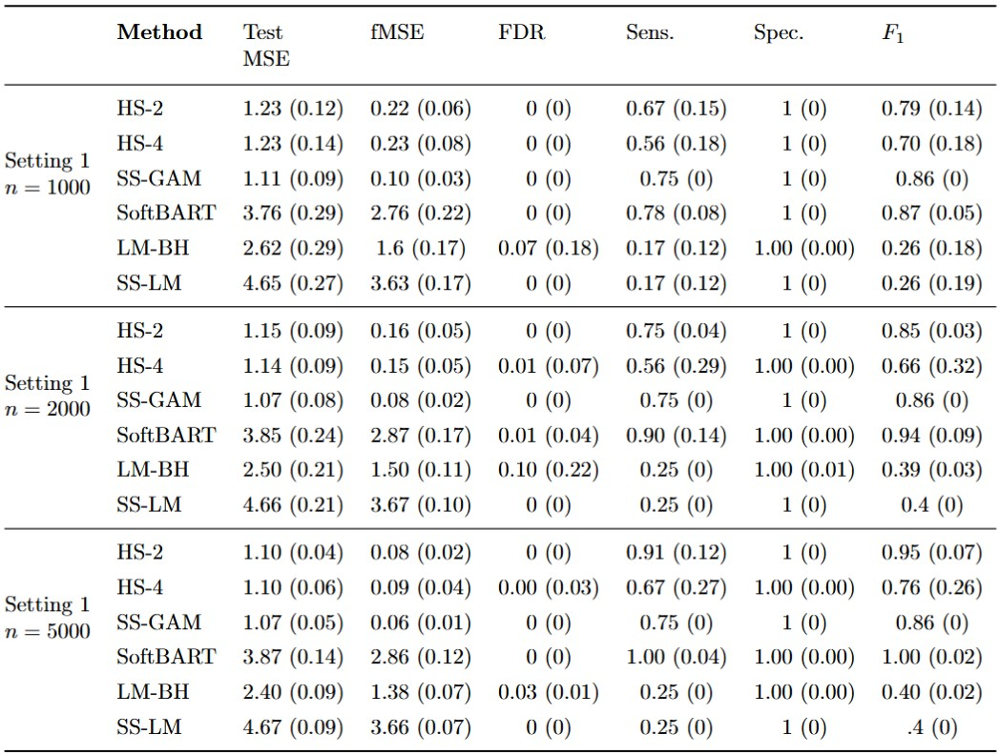
]


???
- note that SS-GAM results at $n=5k$ are on 25 replicates b/c takes 4 hours to run and not very parallelizable, increases quadratically with n.  

- linear methods have major trouble here --- only $f_2$ is asymmetric

- SS-GAM is well-specified here

- SoftBART consistently has best Sensitivity, but we close the gap


---
.lnarrow[
### Setting 2 comparison

- lowest test MSE, fMSE

- fMSE $\downarrow$ while Sensitivity $\uparrow$

- HS-4 < HS-2
___

- SS-GAM having trouble (misspecified)

- SoftBART badly overfitting

]

.rwide[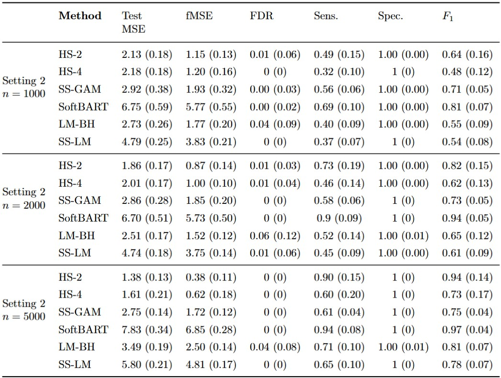]


???
Comments:

- linear methods have major trouble here --- only $f_2$ is asymmetric

- SS-GAM is not well-specified here (interactions not specified in the model)

- SoftBART consistently has best Sensitivity, but we close the gap


  
- main takeaways:

  - VarSel: SoftBART's is better, but its advantage shrinks as n grows, and it seems to overfit the training data
  - MSE and fMSE: 
  - __HS-2 has competitive performance for larger $n$, balancing predictive performance with VarSel performance (sensitivity), and learns from more data__

<!-- If have to choose modeling method:   -->
<!--   - if prediction/varsel both important: -->
<!--     - if sure that model is correctly specified and have relatively small $n$, use SS-GAM.  Also if have very specific question to answer (e.g. question is only about MAIN EFFECT of $x_j$, i.e. separate from interactions between $x_j$ and $x_k$) -->
<!--     - If unsure, or have large $n$, use ours. -->
<!--   - if variable selection most important: -->
<!--     - if sure model is correctly specified, etc., use SS-GAM. -->
<!--     - At low $n$, use SoftBART -->
<!--     - At moderate-large $n$, use ours. -->
<!--   - if prediction most important: -->
<!--     - at low $n$, use SS-GAM. -->
<!--     - else use ours -->


---
## Application to Salary Data
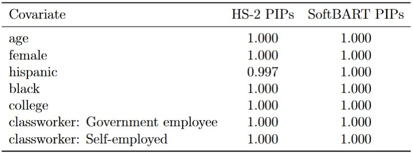

.pull-left[
- $n = 36,308$ single-race, full-time, non-military workers ages 18-65 
- response: $\log_{10}$ annual income

- all categorical besides `age`
]

.pull-right[
- `occupation` not shown here: 24 different levels e.g. `architecture/engineering`, `construction`, `office`, `health` ...

]

???
- different approach / goal here than local null testing, motivated by recognizing that wage gaps are likely to take on different forms based on __(unspecified) interactions__ between variables (e.g. black, non-Hispanic females with college degrees in healthcare vs. sales, or non-black Hispanic males without college degrees in office positions vs. those without college degrees)

- HS-2 model fit to data; no interactions specified (NN implicitly includes interactions)

- __kept variables/categories the same as in Local Null Testing example for better comparison__

- __"Is covariate xj associated with the outcome, whether
through its main effect or interactions?"__

- easy to sample from posterior

Recall the stated desiderata:

- Still want to be able to identify active variables;  

  - (with control over BFDR and FDR)  

- Flexibly model varying, non-linear relationships;  

- Ability to model _granularly_, i.e. learn forms that may differ within subcategories.


---
### Marginal effects: `black`, `female`, `hispanic`


- estimated difference in $\log_{10}$ income __marginalized across all other covariates__

???
- this representation is not additive, i.e. effect of being black AND female is not represented here by adding the effects.  

- easy to get this posterior summary --- e.g. for "female", modify actual dataset to `female = 1` and another `female = 0`, subtract model predictions from each other.  Do this $S$ times.  Howver, interp. needs to be careful --- __NOT A CAUSAL ANALYSIS,__ i.e. covariate dependencies not accounted for.

---
### Marginal effects as %: `black`, `female`, `hispanic`


- difference in real income __marginalized across all other covariates__

???


---
### Gender gap among health workers:

.pull-left[

]

.pull-right[

]


???
- 

- next slide is gender gap among office workers (unique trajectories)

 


---
### Gender gap among office workers:

.pull-left[

]

.pull-right[

]

???

- trajectories unique within every subcategory


---
## Summary


---
## Future Work


---
class:inverse, left, middle

# Appendix A: Local Null Testing

---
## Splines I


???
linearize the VC model by projecting coordinates onto spline basis


---
## Splines II

.lcode[

]

.rplot[

&nbsp;

&nbsp;

$\scriptsize z=\left(\begin{array}{c}-2.0 \\ -1.6 \\ -1.2 \\ -0.8 \\ -0.4 \\ 0.0 \\ 0.4 \\ 0.8 \\ 1.2 \\ 1.6 \\ 2.0\end{array}\right), \mathbf{B}=\left(\begin{array}{ccccccc}.166 & .666 & .166 & .000 & .000 & .000 & .000 \\ .036 & .538 & .414 & .010 & .000 & .000 & .000 \\ .001 & .282 & .630 & .085 & .000 & .000 & .000 \\ .000 & .085 & .630 & .282 & .001 & .000 & .000 \\ .000 & .010 & .414 & .538 & .036 & .000 & .000 \\ .000 & .000 & .166 & .666 & .166 & .000 & .000 \\ .000 & .000 & .036 & .538 & .414 & .010 & .000 \\ .000 & .000 & .001 & .282 & .630 & .085 & .000 \\ .000 & .000 & .000 & .085 & .630 & .282 & .001 \\ .000 & .000 & .000 & .010 & .414 & .538 & .036 \\ .000 & .000 & .000 & .000 & .166 & .666 & .166\end{array}\right)$
]


---
## Splines III


???
thought we could just ID the regions were all the splines over it had coefs of 0


---
## Cut Orthog Basis


---
## Proof of $\eta^\star$

Since $W_0$ and $W_1$ orthogonal,


___

Since $W_1$ is a cut basis,


---
## consistency & # knots
.panelset[

.panel[.panel-name[12 baseline, 8 local]


]

.panel[.panel-name[20 baseline, 15 local]


]

.panel[.panel-name[30 baseline, 30 local]


]

]


---
## indep data sim


---
## salary data: knot sensitivity
.panelset[

.panel[.panel-name[20 knots]


]

.panel[.panel-name[30 knots]


]


]

??? important to note that don't have more high probability regions with 30 knots (our method is unlikely to get moer type 1 errors)


---
class:inverse, left, middle

# Appendix B: BFDR-controlled variable selection in DNNs

---
### Derivation of $\log p(D) = \mathcal{L}(\phi) + KL \left(q_\phi(W) || p(W|D) \right)$

$$\begin{aligned}
  KL \left( q_\phi(\mathbf{W}) || p(\mathbf{W}|\mathcal{D}) \right) 
  & =  \mathbb{E}_{q_\phi} 
    \left[ \log \frac{q_\phi(\mathbf{W})}{p(\mathbf{W}|\mathcal{D})} \right] 
  \\
  & =  \mathbb{E}_{q_\phi}    \left[ \log \left(    q_\phi(\mathbf{W})      \frac{p(\mathcal{D})}{p(\mathcal{D}|\mathbf{W})p(\mathbf{W})} \right) \right]
  \\
  & = \log p(\mathcal{D})  - \mathbb{E}_{q_\phi} \left[\log p(\mathcal{D} | \mathbf{W}) \right] + \mathbb{E}_{q_\phi} \left[ \log \frac{q_\phi(\mathbf{W})}{p(\mathbf{W})} \right]
  \\
  & = \log p(\mathcal{D}) - \mathcal{L}(\phi)
\end{aligned}$$


---
## Calibration of $\tau_0$

Recall the prior for the global scale parameter: $$\tau^{(\ell)} \sim C^+ (0, \tau_0)$$

- global scale parameter in linear models governs overall sparsity level, effectively a prior over model size

- _Piironen & Vehtari 2017_ indicate that the default $\tau_0 = 1$ is typically orders of magnitude too large.  We use their suggestion of (notation modified for our context)

$$\tau^{(l)}_0 = \dfrac{p_0}{d_{\ell-1} - p_0} \dfrac{\hat{\sigma}_\varepsilon}{\sqrt{n}}$$

- $p_0$ = prior guess at number of active coefficients
- $d_{\ell-1}$ = input dimension
- $\hat{\sigma_\varepsilon}$ response standard deviation


???
Mention this in context of calibrating prior on $\tau$, but also to lead into next slide's discussion

- Piironen & Vehtari's suggestion is in context of standard linear regression models, but (just as they do when applying it to other models) we found this to lead to lower training times and better results

- calibration most important for us in 1st layer (we set $p_0 = d / 10$); for secondary layers, use an agnostic $p_0 = d/2$


---
### BFDR calibration: HS-2, no corrections

.lcode[
- HS-2, $n_{train} = 800$

- realized mean BFDR (blue) and FDR over 50 replicates

- shaded regions = min/max over replicates
]

.rplot[

]

???
- clearly miscalibrated


---
### BFDR calibration: HS-2 with $\tau_{m_{eff}}$

.lcode[
- HS-2, $n_{train} = 800$

- realized mean BFDR (blue) and FDR over 50 replicates

- shaded regions = min/max over replicates
]

.rplot[

]

???
much better

---
### BFDR calibration: HS-2, spectral norm correction only

.lcode[
- HS-2, $n_{train} = 800$

- realized mean BFDR (blue) and FDR over 50 replicates

- shaded regions = min/max over replicates

]

.rplot[

]

???
getting better


<!-- --- -->

<!-- class: inverse, left, middle -->

<!-- # .white[ `datagoboop`] -->


<!-- --- -->
<!-- ## `datagoboop` -->

<!-- - an R package for data sonification, or the audio version of data visualization -->

<!-- - built with Sebastian Waz and Jaylen Lee -->

<!-- - includes built-in versions of common plots (audio histogram, scatterplot) -->

<!-- - also allows users to build audio plots piece-by-piece -->


<!-- --- -->
<!-- ## `note()` -->


<!-- ```{r try} -->
<!-- library(datagoboop) -->
<!-- midC_bounce <- note( -->
<!--   pkey = 40,  -->
<!--   vol = 1,  -->
<!--   dur = 2,  -->
<!--   inst_lab = "piano", -->
<!--   decay = TRUE, -->
<!--   decay_rate = 6 -->
<!--   ) -->

<!-- wplay( -->
<!--   midC_bounce,  -->
<!--   file_path = here::here("advancement", "figs", "midC_bounce.wav") -->
<!--   ) -->
<!-- ``` -->


<!-- --- -->

<!-- ## `notes()` -->

<!-- ```{r} -->
<!-- pkeys <- 52:64      # piano keys for a 1 octave chromatic scale -->
<!-- vols <- 1:13 / 13   # increasing volume -->
<!-- durs <- 12:24 / 96  # slowing down -->

<!-- chrom <- notes( -->
<!--   pkey = pkeys,  -->
<!--   vol = vols,  -->
<!--   dur = durs, -->
<!--   decay = TRUE, -->
<!--   progbar = FALSE -->
<!--   ) -->

<!-- wplay( -->
<!--   chrom, -->
<!--   file_path = here::here("personal", "advancement", "figs", "chrom.wav") -->
<!--   ) -->
<!-- ``` -->


<!-- --- -->
<!-- ## `chord()` -->

<!-- ```{r} -->
<!-- chord_prog <- c( -->
<!--   chord(pkey = c(50, 54, 57), decay = TRUE),  -->
<!--   chord(pkey = c(50, 55, 59), decay = TRUE),  -->
<!--   chord(pkey = c(50, 54, 57), decay = TRUE),  -->
<!--   chord(pkey = c(49, 55, 57), decay = TRUE),  -->
<!--   chord(pkey = c(50, 54, 57), decay = TRUE) -->
<!-- ) -->

<!-- wplay( -->
<!--   chord_prog, -->
<!--   file_path = here::here("personal", "advancement", "figs", "chords.wav") -->
<!-- ) -->
<!-- ``` -->


<!-- --- -->
<!-- ## audio histogram  -->

<!-- ```{r} -->
<!-- set.seed(2) -->
<!-- y <- rnorm(1000, 40, 5) -->
<!-- breaks = seq( -->
<!--   floor(min(y)),  -->
<!--   floor(max(y)) + 1,  -->
<!--   length.out = 16 -->
<!--   ) -->
<!-- hist_info <- hist(y, breaks = breaks) -->


<!-- df <- data.frame(y) -->
<!-- wplay( -->
<!--   sonify_hist( -->
<!--     data = df,  -->
<!--     var = "y",  -->
<!--     breaks = 16,  -->
<!--     duration = 5 -->
<!--     ), -->
<!--   file_path = here::here("personal", "advancement", "figs", "sonifyhist.wav") -->
<!--   ) -->
<!-- ``` -->


<!-- --- -->
<!-- ## scatterplot -->

<!-- ```{r} -->
<!-- library(ggplot2) -->
<!-- ggplot( -->
<!--   mtcars,  -->
<!--   aes( -->
<!--     y=disp,  -->
<!--     x = mpg,  -->
<!--     size = factor(gear), -->
<!--     color = factor(gear) -->
<!--     ) -->
<!--   ) +  -->
<!--   geom_point(alpha = 0.4) +  -->
<!--   labs(title = "mtcars") -->
<!-- ``` -->


<!-- ```{r} -->
<!-- mtcars_audio <- sonify_scatter( -->
<!--   data = mtcars, -->
<!--   x_var = "mpg", -->
<!--   y_var = "disp", -->
<!--   factor_var = "gear", -->
<!--   volume = "gear", -->
<!--   vol_scaling = "binned 3 exp 2" -->
<!--   ) -->

<!-- wplay( -->
<!--   mtcars_audio,  -->
<!--   file_path = here::here("personal", "advancement", "figs", "mtc.wav") -->
<!--   ) -->
<!-- ``` -->


<!-- --- -->
<!-- ## Bach -->

<!-- ```{r} -->
<!-- bp2 <- bach() -->
<!-- wplay( -->
<!--   bp2, -->
<!--   file_path = here::here("personal", "advancement", "figs", "bach.wav") -->
<!--   ) -->
<!-- ``` -->


